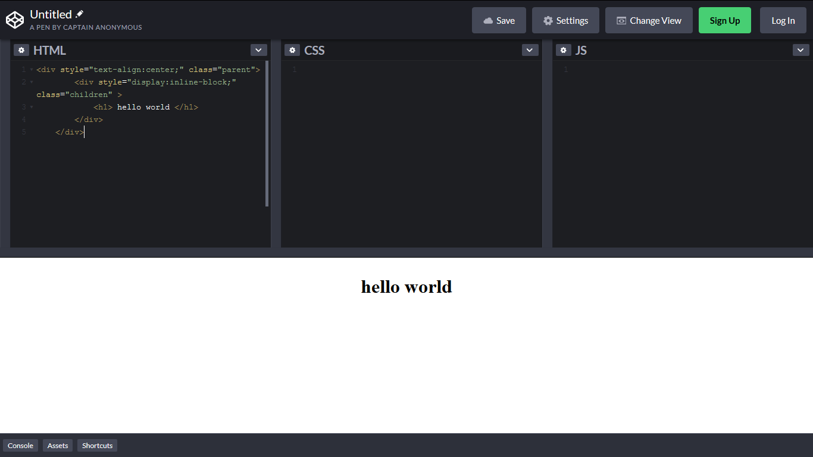

Hola, este es el primer post de este blog. Servirá a modo de pruebas para comprobar si esta correcto el funcionamiento de todas las librerías integradas, así como el diseño. Bueno aclarando el propósito del post procedo a realizar el tutorial.

Para realizarlo, tienen que modificar tanto el css del div padre, como el elemento o div hijo que quieran centrar, supongamos por ejemplo esta estructura en Html.

```javascript
    <div class="parent">
        <div class="children" >
            <h1> hello world </h1>
        </div>
    </div>
```

Para lograrlo, tenemos que modificar el css de ambos, ya sea en una hoja aparte de .css que importemos en el cabezal del documento html, o ahi mismo, en el div padre, tenemos que colocar alineación de texto centrada con la propiedad text-align, y en el elemento hijo, hay que configurar la propiedad display, con el parámetro inline-block. Como en el siguiente ejemplo.

```javascript
    <div style="text-align:center;" class="parent">
        <div style="display:inline-block;" class="children" >
            <h1> hello world </h1>
        </div>
    </div>
```

Finalmente tenemos el resultado en la siguiente captura de pantalla, cable aclarar que este código les servira para diseño responsive, así como trabajar con grids de distintas librerias de diseño. Bueno muchas gracias por leer.

